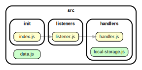

<!-- BEGIN TITLE -->

# DOCS

<!-- END TITLE -->

<!-- BEGIN TREE -->

<!-- END TREE -->

<!-- BEGIN TOC -->

- handlers
  - [handler.js](#srchandlershandlerjs)
  - [local-storage.js](#srchandlerslocal-storagejs)
- init
  - [index.js](#srcinitindexjs)
- listeners
  - [listener.js](#srclistenerslistenerjs)
- logic
- procedures
- [data.js](#srcdatajs)

<!-- END TOC -->

<!-- BEGIN DOCS -->

---

# /handlers

<a href="../src/handlers/handler.js" id="srchandlershandlerjs">src/handlers/handler.js</a>

<a href="../src/handlers/local-storage.js" id="srchandlerslocal-storagejs">src/handlers/local-storage.js</a>

---

[TOP](#DOCS)

---

# /init

<a href="../src/init/index.js" id="srcinitindexjs">src/init/index.js</a>

---

[TOP](#DOCS)

---

# /listeners

<a href="../src/listeners/listener.js" id="srclistenerslistenerjs">src/listeners/listener.js</a>

---

[TOP](#DOCS)

---

# /logic

---

[TOP](#DOCS)

---

# /procedures

---

[TOP](#DOCS)

<a href="../src/data.js" id="srcdatajs">src/data.js</a>

<!-- END DOCS -->
